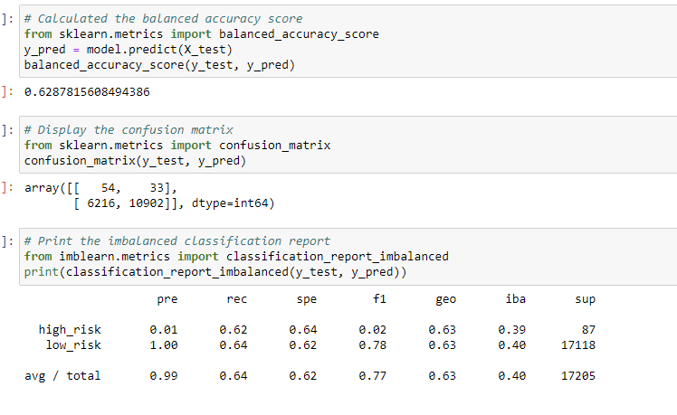
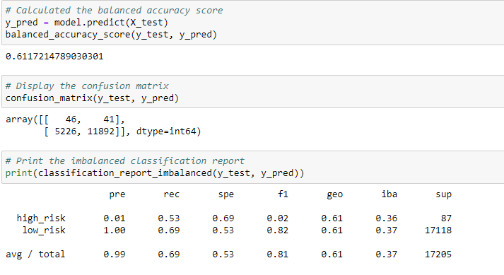
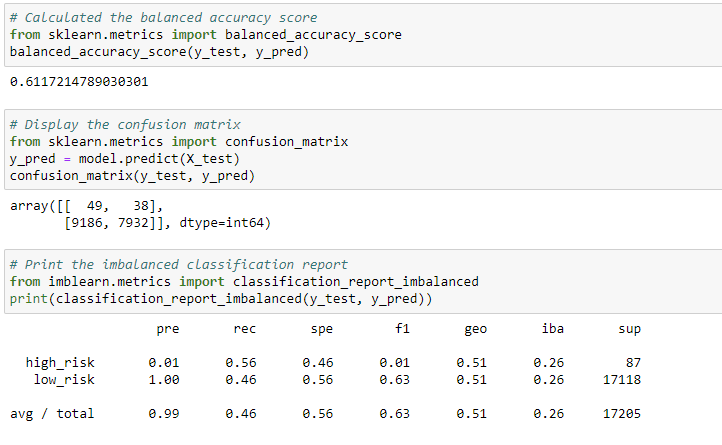
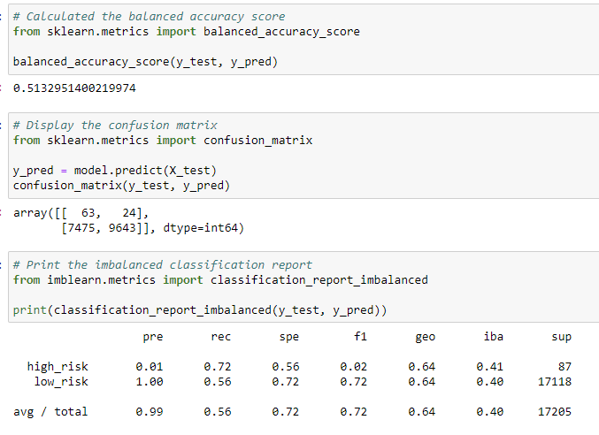
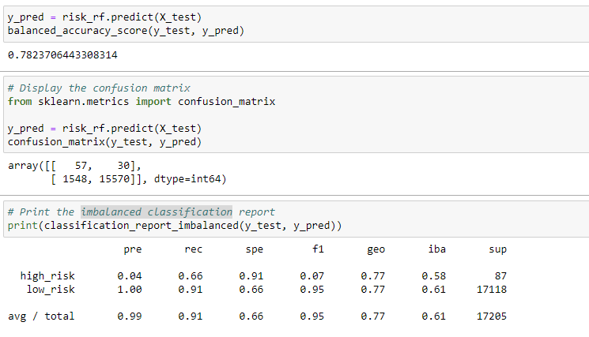
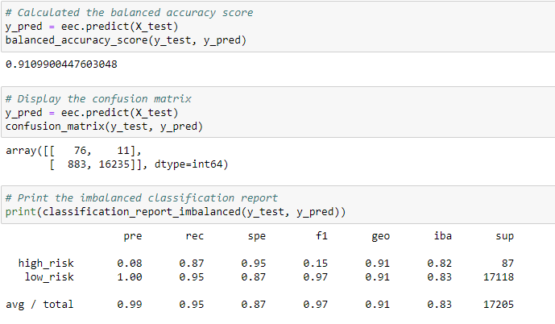

# Credit Risk Analysis

# Overview
Use Machine Learning Models that will allow us to resample data to adjust for class imbalance in the dataset. Apply machine learning to solve a real-world challenge.

# Results

## Naive Random Oversampling

If one class has too few instances in the training set, we choose more instances from that class for training until it is larger.
The balance accuracy score was 0.6287 which means that the model was 62.9% accurate when predicting defaults in this dataset.
Precision Score: 0.99 and Recall Score: 0.64 

## SMOTE Oversampling

In the synthetic minority oversampling technique, the size of the minority is increased, and new instances are interpolated based on an instance from the minority class and a number of its closest neighbors. Note: This makes the model vulnerable to outliers!
The balance accuracy score was 0.6117 which means that the model was 61.2% accurate when predicting defaults in this dataset.
Precision Score: 0.99 and Recall Score: 0.69

## Undersampling

Is the opposite approach of oversampling, the size of the majority class is decreased, and only uses actual data.
The balance accuracy score was 0.6117 which means that the model was 61.2% accurate when predicting defaults in this dataset.
Precision Score: 0.99 and Recall Score: 0.46

## Combination (Over and Under) Sampling

An approach to resampling that combines aspects of both oversampling and undersampling
The balance accuracy score was 0.5132 which means that the model was 51.3% accurate when predicting defaults in this dataset.
Precision Score: 0.99 and Recall Score: 0.56

## Balanced Random Forest Classifier

Combines many decision trees into a forest of trees
The balance accuracy score was 0.7823 which means that the model was 78.2% accurate when predicting defaults in this dataset.
Precision Score: 0.99 and Recall Score: 0.91

## Easy Ensemble AdaBoost Classifier

Weighting of previous errors to minimize similar errors in subsequent models.
The balance accuracy score was 0.9109 which means that the model was 91.1% accurate when predicting defaults in this dataset.
Precision Score: 0.99 and Recall Score: 0.95

# Summary:

Overall, the Ensemble Learners outperformed the other resampling techniques. I would suggest using the easy ensemble learning model because it has a high F-score showing that precision and recall are both also high. 
The concept of ensemble learning is the process of combining multiple models, like decision tree algorithms, to help improve the accuracy and robustness, as well as decrease variance of the model, and therefore increase the overall performance of the model.
